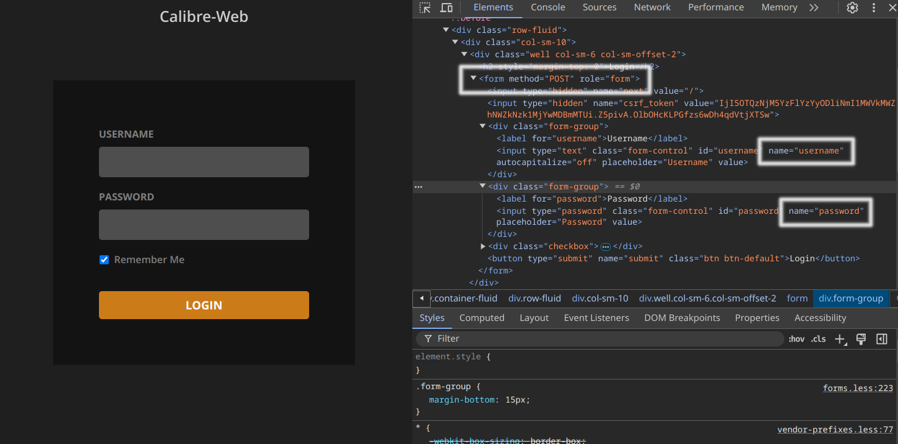

Crawling an Authenticated Website
=================================

Sosse enables crawling web pages that require authentication. While authentication can be managed via cookies or
JavaScript, cookies expire, and JavaScript can be complex to configure. Instead, Sosse allows authentication directly
within the Collection by submitting the login form. As an example, we will demonstrate how to authenticate to
Calibre-Web, an open source book library, see https://github.com/janeczku/calibre-web.

Creating a Collection for an Authenticated Website
----------------------------------------------------

To begin, identify the authentication details on the login page:

- Open Calibre-Web in a browser and navigate to the login page.
- Use developer tools to inspect the login form and find its
  `CSS selector <https://developer.mozilla.org/en-US/docs/Learn_web_development/Core/Styling_basics/Basic_selectors>`_.
- Identify the ``name`` attributes of the username and password input fields.

With this information, configure the :doc:`Collection <../crawl/collections>`:

- In the ``⚡ Crawl`` tab, define the URL patterns:

  - ``^http://<url of the Calibre-Web instance>/$`` for the homepage.
  - ``^http://<url of the Calibre-Web instance>/page/[0-9]+$`` for pagination.
  - ``^http://<url of the Calibre-Web instance>/book/[0-9]+$`` for books.

- In the ``🔒 Authentication`` tab:

  - ``Login URL regex``: ``http://<url of the Calibre-Web instance>/login`` — authentication is attempted when redirected here.
  - ``Form selector``: ``form`` — as Calibre-Web has a single ``<form>`` element.
  - Authentication fields:

    - ``username``: e.g., ``admin``
    - ``password``: e.g., ``admin123``

.. image:: ../../../tests/robotframework/screenshots/guide_authentication_auth.png
   :class: sosse-screenshot

Once configured, Sosse will authenticate whenever it encounters the login page.

Starting the Crawl
------------------

After configuring authentication in the Collection, navigate to the :doc:`Crawl a new URL <../crawl/new_url>` page and
enter the Calibre-Web instance URL.

Review the parameters and click ``Add to Crawl Queue``. Sosse will log in using the provided credentials and begin
crawling pages accessible to the authenticated user.

Searching the Library
---------------------

Once the crawl is complete, you can search for books, authors, or any text available in the Calibre-Web instance.

.. image:: ../../../tests/robotframework/screenshots/guide_authentication_search.png
   :class: sosse-screenshot

For advanced search options, refer to the :doc:`search parameters <../user/search>` documentation.
