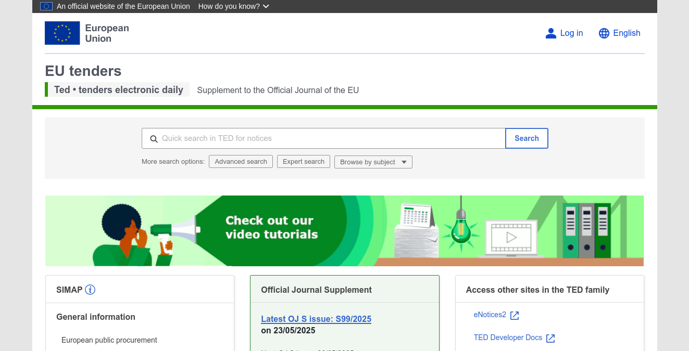
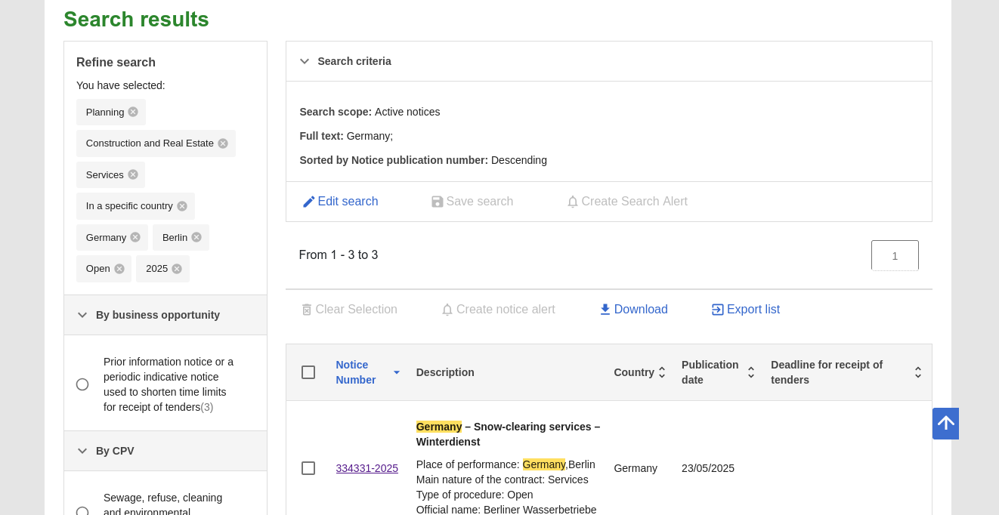

Extracting Metadata from Public Procurement with JavaScript
===========================================================

This guide explains how to use Sosse to crawl procurement notices published on the European public procurement
portal, TED (Tenders Electronic Daily, available at `ted.europa.eu <https://ted.europa.eu/>`_). TED is the official
platform for publishing public procurement notices from across Europe. We'll show how to extract metadata from these
offer pages using JavaScript, covering setup, crawling, and export.

Setting up a Collection for Metadata Extraction
-------------------------------------------------

Collections define how Sosse interacts with targeted web pages. In this scenario, we want to extract structured data
(such as offer title, deadline, country, etc.) from public offer listings using JavaScript. For more background, see the
:doc:`../crawl/collections` documentation.

- **Navigate to Collections**: Go to the :doc:`../crawl/collections` page from the admin menu.

- **Create a Collection**:
  - In the `⚡ Crawl` tab, set an ``Unlimited depth URL regex`` that targets the public offer detail pages on TED::

     ^https://ted.europa.eu/en/notice/-/detail/[0-9]*-.*

  - In the ``🌍 Browser`` tab, set ``Default browse mode`` to ``Firefox`` or ``Chromium``. We select a browser that can
    execute JavaScript.

  - In the same tab, in the ``Script`` field, provide a script that will run in the browser context of each page.
    Any data returned by the script is used to update the data of the crawled URL. Content-specific metadata can be
    stored in the `metadata` field (see :ref:`Collection Script<collection_script>`).

    You can write your own script or use AI tools such as GitHub Copilot or ChatGPT to generate a script. To get started,
    visit an example offer page, such as
    `https://ted.europa.eu/en/notice/-/detail/123456-2024 <https://ted.europa.eu/en/notice/-/detail/123456-2024>`_ and
    inspect the elements you want to extract::

      return {
        metadata: {
          title: document.querySelector('h1')?.innerText || '',
          ...
        }
      };

  - Under the ``🕑 Recurrence`` tab, set ``Crawl frequency`` to ``Once`` to avoid re-crawling the same articles.

.. image:: ../../../tests/robotframework/screenshots/guide_data_extract_collection.png
   :class: sosse-screenshot

Searching for Public Offers and Queuing URLs
--------------------------------------------

- **Search for Offers**:

  - Go to the `TED (Tenders Electronic Daily) search page <https://ted.europa.eu/en/search/result>`_.
  - Use the filters to select the types of offers you're interested in.

- **Queue Search Result URLs in Sosse**:

  - Copy the URLs of the offer detail pages you wish to crawl.
  - Go to the :doc:`Crawl a new URL <../crawl/new_url>` page in Sosse and paste the URLs.
  - Click ``Add to Crawl Queue`` to queue the crawl jobs.

.. note::
   By default, this will crawl the offers and regularly check for new ones as defined in the ⚡ Collection.
   See :ref:`collection_recurrence`.

Reviewing Extracted Results
---------------------------

After the crawl jobs complete, you can review the extracted metadata in several ways:

- **From the Document Page**: Go to the :doc:`../documents` page to view the extracted data in the ``📊 Metadata``
  section.

.. image:: ../../../tests/robotframework/screenshots/guide_data_extract_document_metadata.png
   :class: sosse-screenshot

- **CSV Export**: On the :doc:`../user/search` page, use the ``CSV Export`` feature to download the results.

.. image:: ../../../tests/robotframework/screenshots/guide_data_extract_csv_export.png
     :class: sosse-screenshot

- **Rest API**: Access the extracted results via the :doc:`../user/rest_api`, which allows programmatic access to the
  data.

Additional Options
------------------

By combining Sosse's crawling and JavaScript extraction features, you can efficiently monitor TED's public offer portal,
extract structured data, and automate notifications.

To stay updated about new or changed offers, you can:

- Notify other services via :doc:`../webhooks`
- Generate :ref:`Atom feeds <ui_atom_feeds>` to subscribe to updates (see the
  :doc:`Atom feeds guide <feed_website_monitor>`).
